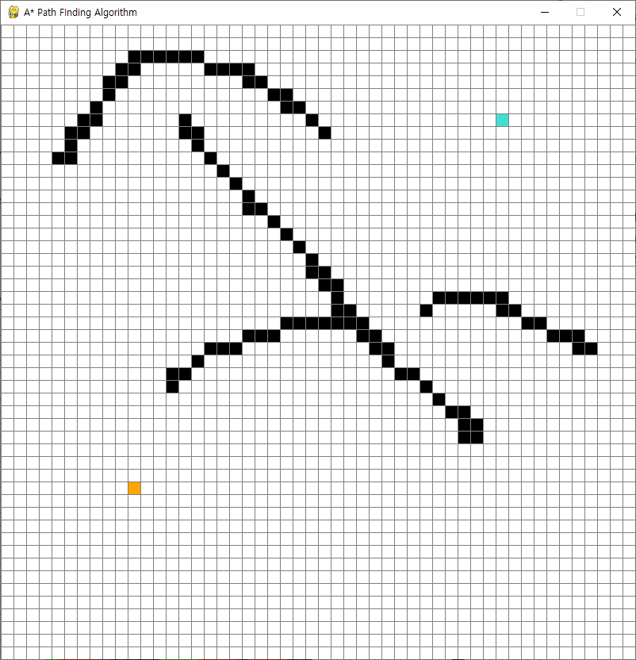

# algorithm-a-star
A\* pathfinding visualization by pygame.

[reference link](https://www.youtube.com/watch?v=JtiK0DOeI4A&t=1201s)

add diagonal path!

but it has some problems.. by heursistic logic TT..

## how to start

click start and end, then drag to make barrier

## run

"spacebar" will make it run!

